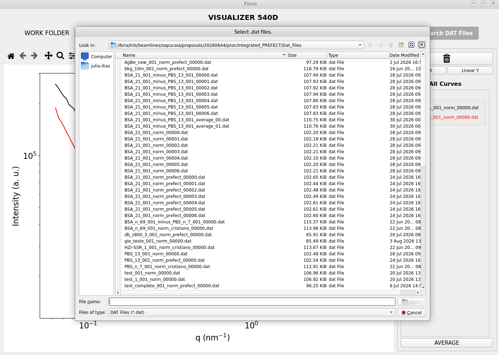
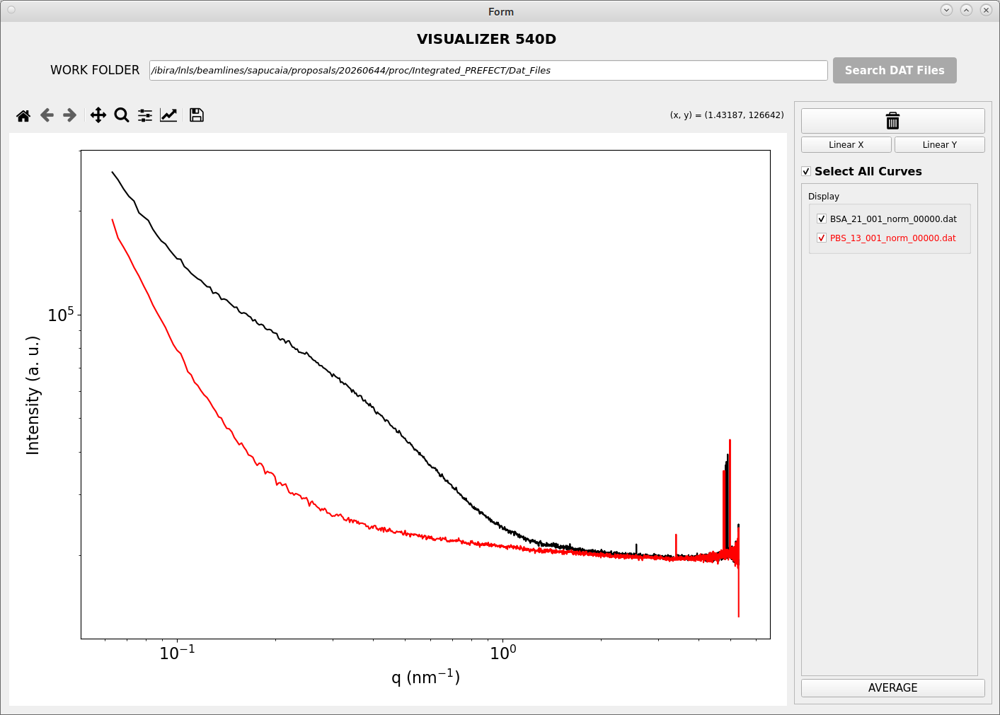
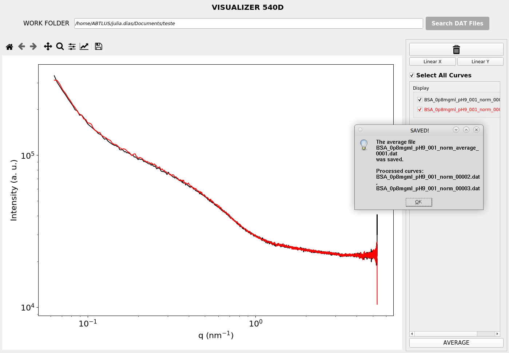

# SAPUCAIA SAXS Visualizer

**SAPUCAIA SAXS Visualizer** is a graphical user interface (GUI) developed for the visualization and analysis of Small-Angle X-ray Scattering (SAXS) data collected at the SAPUCAIA beamline of the Brazilian Synchrotron Light Laboratory (LNLS), part of the Brazilian Center for Research in Energy and Materials (CNPEM).

The software provides tools for loading, visualizing, comparing, and processing SAXS data, with the goal of supporting efficient data inspection during beamline operation and scientific experiments.

> [!NOTE]
> This project is under heavy development and new features are being added frequently.

## Features

* Visualization of SAXS curves from `.dat` files
* Multiple-curve visualization and comparison
* Selection and deselection of individual curves
* Customization of X and Y axis scales
* Curve deletion from the visualization
* Calculation and visualization of average curves
* Export of averaged data
* Graphical interface designed for use with SAXS measurements

## Project Structure

```text
sapucaia-saxs-visualizer/
├── examples/
│   └── BSA_21_001_norm_00000.dat
│   └── PBS_13_001_norm_00000.dat
├── images/
│   └── delete.svg
│   └── visualizer_avg.png
│   └── visualizer_curves.png
│   └── visualizer_files.png
│   └── visualizer_icon.png
├── environment.yml
├── LICENSE
├── README.md
├── RGB_codes.py
├── visualizer_540d.py
└── visualizer_540d.ui
```

### Main files

* `visualizer_540d.py` — Main Python source code of the graphical interface and data visualization functionality.
* `visualizer_540d.ui` — Qt Designer interface file used to define the graphical user interface.
* `RGB_codes.py` — Color definitions used by the graphical interface.

## Requirements

The software requires Python 3 and the following Python packages:

* PyQt5
* Matplotlib
* NumPy
* Pandas

The exact Python version and package dependencies are specified in the project's `environment.yml` file to ensure reproducibility.

## Installation

The recommended installation method for the SAPUCAIA SAXS Visualizer is **Conda**.

If Conda is not installed on your computer, install **Miniconda**, a lightweight Conda distribution that provides the Conda package and environment manager.

### 1. Clone the repository

Clone the repository using:

```bash
git clone https://github.com/cnpem/sapucaia-saxs-visualizer.git
cd saxs_visualization_gui
```

### 2. Create the Conda environment

Create the environment using the `environment.yml` file provided with the repository:

```bash
conda env create -f environment.yml
```

This automatically installs the required Python version and dependencies.

### 3. Activate the environment

Activate the newly created environment:

```bash
conda activate saxs-visualizer
```

### 4. Run the application

From the project directory, run:

```bash
python visualizer_540d.py
```

The SAPUCAIA SAXS Visualizer graphical interface should then open.

### Updating the software

If the repository has already been cloned and a new version is available, update the local copy using:

```bash
git pull origin main
```

If the project's dependencies have changed, update the Conda environment using:

```bash
conda activate saxs-visualizer
conda env update -f environment.yml --prune
```

The `--prune` option removes packages that are no longer specified in `environment.yml`.

## Input Data

The Visualizer is designed to work with SAXS data files in `.dat` format generated during measurements at the SAPUCAIA beamline.
The expected data format should be described here, including:
* File structure
* Header information
* Column definitions
* Units
* Required fields

## Example Data

Two example SAXS data files are provided in the `examples/` directory.
These files can be used to verify the installation and demonstrate the
expected input format of the software.

- `BSA_21_001_norm_00000.dat`
- `PBS_13_001_norm_00000.dat`

## Using the Visualizer

### Loading data

Use the file selection interface to select one or more `.dat` files for visualization.

<p align="center">
  
</p>

### Selecting curves

Individual curves can be selected or deselected from the list of loaded files. Only selected curves are displayed in the plot.

<p align="center">
  
</p>

### Plot configuration

The software allows the user to modify the visualization parameters, including:
* X-axis scale
* Y-axis scale
* Curve selection
* Curve removal
* Curve transparency

### Averaging curves

The software provides functionality for calculating an average curve from selected SAXS datasets.
The resulting averaged curve can be saved as a `.dat` file for further analysis.

<p align="center">
  
</p>

## Citation

If you use SAPUCAIA SAXS Visualizer in your research, please cite:

> Zerba, J. P. C.; Souza, J. D. *SAPUCAIA SAXS Visualizer*. Zenodo.
> DOI: To be assigned upon publication.

## License

SAPUCAIA SAXS Visualizer is distributed under the terms of the **GNU General Public License version 3 (GPLv3)**.
You may use, study, modify, and redistribute the software under the terms of this license.
The complete license text is available in the [`LICENSE`](LICENSE) file.

## Acknowledgements

This software was developed for the SAPUCAIA beamline at the Brazilian Synchrotron Light Laboratory (LNLS), part of the Brazilian Center for Research in Energy and Materials (CNPEM).
The authors acknowledge the support of CNPEM and the LNLS team in the development and commissioning of the software.

## Contact

For information, support, or questions regarding the SAPUCAIA beamline,
please contact the beamline team:

- **Facility:** SAPUCAIA Beamline
- **Facility E-mail:** sapucaia@lnls.br
- **Website:** [SAPUCAIA Beamline – LNLS](https://lnls.cnpem.br/facilities/sapucaia-en/)